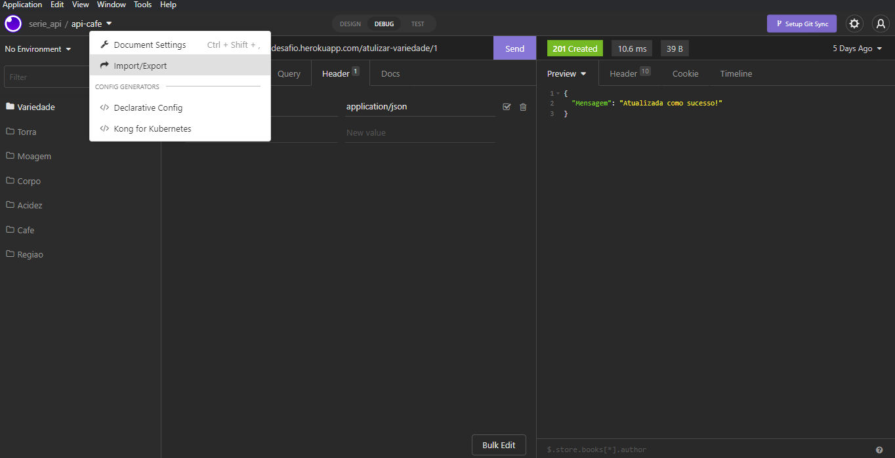
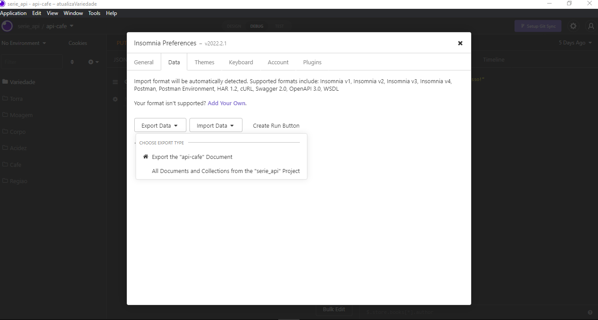
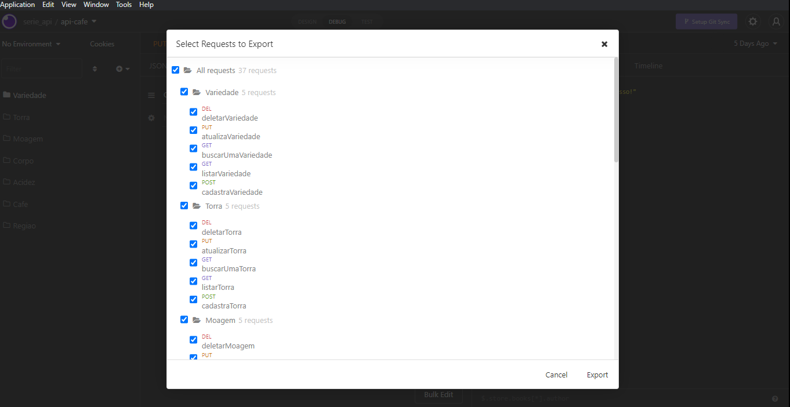
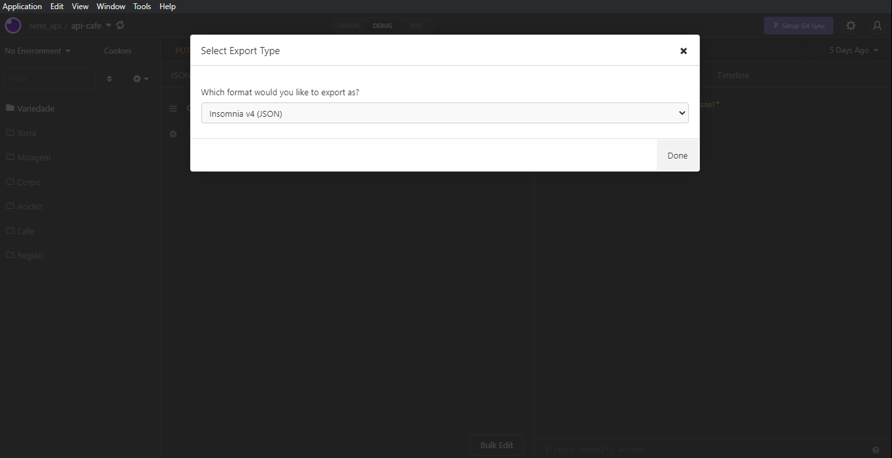

# Documentação da api do Desafio chefão

<a href="https://sharp-minsky-130ff4.netlify.app/" >Clique aqui</a> para ver a documentação.
# Documentação da api do Desafio chefão
Nesse documento mostraremos o passo a passo para fazer a documentão de uma api de forma rápida e pratica.
# 1ª - Abra sua api no INSOMNIA e clique em IMPORT/EXPORT.

# 2ª - Clique em DATA e selecione EXPORT DATA e clique na sua api.7

# 3º - Clique em EXPORT.

# 4ª - Clique em DONE e salve seu arquivo em uma pasta.

# 5ª - Abra o seu terminal e navegue até a pasta onde está o seu aquivo json criado no passo anterior.

# 6ª - Nesse ponto digite os seguites comandos em seu terminal.

         npx insomnia-documenter --config <nomedo-seu-arquivo>.json

# 7ª - Segundo comando.

         npx insomnia-documenter --config <nomedo-seu-arquivo>.json --output insomnia-documenter-demo

# 8ª - Ultimo comando é para ver a documentção.

         npx serve

# 9ª - No seu navegador acesse.

         http://localhost:3000/

# Final, agora você pode fazer o hospedar a sua documentação.

# API

<h3>Configurações<h3>

<ol>
<li>yarn init </li>
<li>yarn</li>
<li>yarn add express --save </li>
<li>yarn add nodemon -D</li>
<li>yarn add sequelize</li>
<li>yarn add mysql2</li>
<li>yarn add dotenv</li>
<li>yarn add cors</li>
  </ol>
  
  <h1>ATENÇÃO: se você fizer o git clone desse projeto apenas execute o "yarn" que ele instalarar todas as dependencias.</h1>
  
  <h3>Orientação para criação do .env</h3>
      
        BANCO=nome_do_seu_banco_de_dados
        USER=nome_do_seu_usuario(Geralmente é o root)
        PORTA=porta(Geralmete é o localhost)
        DIALECT=mysql(Deixe mysql que é o tipo de banco de dados que estamos usando)
        PASWORD=coloque_sua_senha
  
  Apos essas configurações rode sua aplicação
  
  <h3>Mudando de Branch e Mesclando com outra Branch</h3>
  Para mais informações <a href="https://git-scm.com/book/pt-br/v2/Branches-no-Git-O-b%C3%A1sico-de-Ramifica%C3%A7%C3%A3o-Branch-e-Mesclagem-Merge">Clique aqui</a>
  
         git checkout master ou main
         git merge <nome_da_branch_que_vai_ter_suas_alterções_mandadas_para_a_main>
