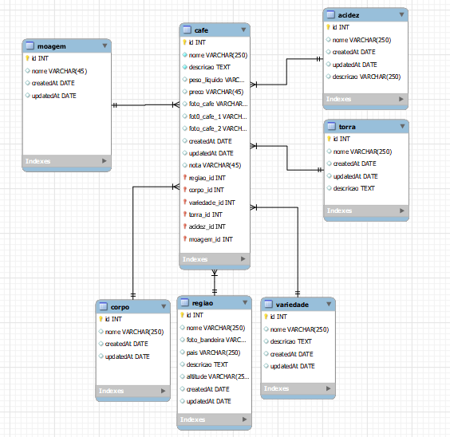

# Banco de dados 

<h4>Esquema</h4>

<h4>Scripts</h4>

            -- MySQL Workbench Forward Engineering

SET @OLD_UNIQUE_CHECKS=@@UNIQUE_CHECKS, UNIQUE_CHECKS=0;
SET @OLD_FOREIGN_KEY_CHECKS=@@FOREIGN_KEY_CHECKS, FOREIGN_KEY_CHECKS=0;
SET @OLD_SQL_MODE=@@SQL_MODE, SQL_MODE='ONLY_FULL_GROUP_BY,STRICT_TRANS_TABLES,NO_ZERO_IN_DATE,NO_ZERO_DATE,ERROR_FOR_DIVISION_BY_ZERO,NO_ENGINE_SUBSTITUTION';

-- -----------------------------------------------------
-- Schema bd_cafe-two
-- -----------------------------------------------------

-- -----------------------------------------------------
-- Schema bd_cafe-two
-- -----------------------------------------------------
CREATE SCHEMA IF NOT EXISTS `bd_cafe-two` DEFAULT CHARACTER SET utf8 ;
USE `bd_cafe-two` ;

-- -----------------------------------------------------
-- Table `bd_cafe-two`.`moagem`
-- -----------------------------------------------------
CREATE TABLE IF NOT EXISTS `bd_cafe-two`.`moagem` (
  `id` INT NOT NULL AUTO_INCREMENT,
  `nome` VARCHAR(45) NULL,
  `createdAt` DATE NULL,
  `updatedAt` DATE NULL,
  PRIMARY KEY (`id`))
ENGINE = InnoDB;

-- -----------------------------------------------------
-- Table `bd_cafe-two`.`regiao`
-- -----------------------------------------------------
CREATE TABLE IF NOT EXISTS `bd_cafe-two`.`regiao` (
  `id` INT NOT NULL AUTO_INCREMENT,
  `nome` VARCHAR(250) NULL,
  `foto_bandeira` VARCHAR(250) NULL,
  `pais` VARCHAR(250) NULL,
  `descricao` TEXT NULL,
  `altitude` VARCHAR(250) NULL,
  `createdAt` DATE NULL,
  `updatedAt` DATE NULL,
  PRIMARY KEY (`id`))
ENGINE = InnoDB;

-- -----------------------------------------------------
-- Table `bd_cafe-two`.`corpo`
-- -----------------------------------------------------
CREATE TABLE IF NOT EXISTS `bd_cafe-two`.`corpo` (
  `id` INT NOT NULL AUTO_INCREMENT,
  `nome` VARCHAR(250) NULL,
  `createdAt` DATE NULL,
  `updatedAt` DATE NULL,
  PRIMARY KEY (`id`))
ENGINE = InnoDB;

-- -----------------------------------------------------
-- Table `bd_cafe-two`.`variedade`
-- -----------------------------------------------------
CREATE TABLE IF NOT EXISTS `bd_cafe-two`.`variedade` (
  `id` INT NOT NULL AUTO_INCREMENT,
  `nome` VARCHAR(250) NULL,
  `descricao` TEXT NULL,
  `createdAt` DATE NULL,
  `updatedAt` DATE NULL,
  PRIMARY KEY (`id`))
ENGINE = InnoDB;

-- -----------------------------------------------------
-- Table `bd_cafe-two`.`torra`
-- -----------------------------------------------------
CREATE TABLE IF NOT EXISTS `bd_cafe-two`.`torra` (
  `id` INT NOT NULL AUTO_INCREMENT,
  `nome` VARCHAR(250) NULL,
  `createdAt` DATE NULL,
  `updatedAt` DATE NULL,
  `descricao` TEXT NULL,
  PRIMARY KEY (`id`))
ENGINE = InnoDB;

-- -----------------------------------------------------
-- Table `bd_cafe-two`.`acidez`
-- -----------------------------------------------------
CREATE TABLE IF NOT EXISTS `bd_cafe-two`.`acidez` (
  `id` INT NOT NULL AUTO_INCREMENT,
  `nome` VARCHAR(250) NULL,
  `createdAt` DATE NULL,
  `updatedAt` DATE NULL,
  `descricao` VARCHAR(250) NULL,
  PRIMARY KEY (`id`))
ENGINE = InnoDB;

-- -----------------------------------------------------
-- Table `bd_cafe-two`.`cafe`
-- -----------------------------------------------------
CREATE TABLE IF NOT EXISTS `bd_cafe-two`.`cafe` (
  `id` INT NOT NULL AUTO_INCREMENT,
  `nome` VARCHAR(250) NOT NULL,
  `descricao` TEXT NOT NULL,
  `peso_liquido` VARCHAR(45) NULL,
  `preco` VARCHAR(45) NULL,
  `foto_cafe` VARCHAR(250) NULL,
  `fot0_cafe_1` VARCHAR(250) NULL,
  `foto_cafe_2` VARCHAR(250) NULL,
  `createdAt` DATE NULL,
  `updatedAt` DATE NULL,
  `nota` VARCHAR(45) NULL,
  `regiao_id` INT NOT NULL,
  `corpo_id` INT NOT NULL,
  `variedade_id` INT NOT NULL,
  `torra_id` INT NOT NULL,
  `acidez_id` INT NOT NULL,
  `moagem_id` INT NOT NULL,
  PRIMARY KEY (`id`, `regiao_id`, `corpo_id`, `variedade_id`, `torra_id`, `acidez_id`, `moagem_id`),
  INDEX `fk_cafe_regiao1_idx` (`regiao_id` ASC) VISIBLE,
  INDEX `fk_cafe_corpo1_idx` (`corpo_id` ASC) VISIBLE,
  INDEX `fk_cafe_variedade1_idx` (`variedade_id` ASC) VISIBLE,
  INDEX `fk_cafe_torra1_idx` (`torra_id` ASC) VISIBLE,
  INDEX `fk_cafe_acidez1_idx` (`acidez_id` ASC) VISIBLE,
  INDEX `fk_cafe_moagem1_idx` (`moagem_id` ASC) VISIBLE,
  CONSTRAINT `fk_cafe_regiao1`
    FOREIGN KEY (`regiao_id`)
    REFERENCES `bd_cafe-two`.`regiao` (`id`)
    ON DELETE NO ACTION
    ON UPDATE NO ACTION,
  CONSTRAINT `fk_cafe_corpo1`
    FOREIGN KEY (`corpo_id`)
    REFERENCES `bd_cafe-two`.`corpo` (`id`)
    ON DELETE NO ACTION
    ON UPDATE NO ACTION,
  CONSTRAINT `fk_cafe_variedade1`
    FOREIGN KEY (`variedade_id`)
    REFERENCES `bd_cafe-two`.`variedade` (`id`)
    ON DELETE NO ACTION
    ON UPDATE NO ACTION,
  CONSTRAINT `fk_cafe_torra1`
    FOREIGN KEY (`torra_id`)
    REFERENCES `bd_cafe-two`.`torra` (`id`)
    ON DELETE NO ACTION
    ON UPDATE NO ACTION,
  CONSTRAINT `fk_cafe_acidez1`
    FOREIGN KEY (`acidez_id`)
    REFERENCES `bd_cafe-two`.`acidez` (`id`)
    ON DELETE NO ACTION
    ON UPDATE NO ACTION,
  CONSTRAINT `fk_cafe_moagem1`
    FOREIGN KEY (`moagem_id`)
    REFERENCES `bd_cafe-two`.`moagem` (`id`)
    ON DELETE NO ACTION
    ON UPDATE NO ACTION)
ENGINE = InnoDB;

SET SQL_MODE=@OLD_SQL_MODE;
SET FOREIGN_KEY_CHECKS=@OLD_FOREIGN_KEY_CHECKS;
SET UNIQUE_CHECKS=@OLD_UNIQUE_CHECKS;
