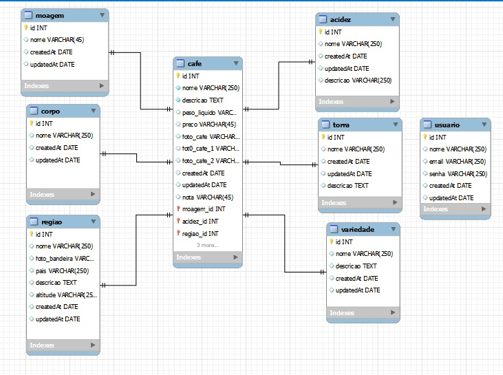

# Banco de dados 

<h4>Esquema</h4>

<h4>Codigo Sql</h4>

            -- MySQL Workbench Forward Engineering

            SET @OLD_UNIQUE_CHECKS=@@UNIQUE_CHECKS, UNIQUE_CHECKS=0;
            SET @OLD_FOREIGN_KEY_CHECKS=@@FOREIGN_KEY_CHECKS, FOREIGN_KEY_CHECKS=0;
            SET @OLD_SQL_MODE=@@SQL_MODE, SQL_MODE='ONLY_FULL_GROUP_BY,STRICT_TRANS_TABLES,NO_ZERO_IN_DATE,NO_ZERO_DATE,ERROR_FOR_DIVISION_BY_ZERO,NO_ENGINE_SUBSTITUTION';

            -- -----------------------------------------------------
            -- Schema bd_cafe
            -- -----------------------------------------------------

            -- -----------------------------------------------------
            -- Schema bd_cafe
            -- -----------------------------------------------------
            CREATE SCHEMA IF NOT EXISTS `bd_cafe` DEFAULT CHARACTER SET utf8 ;
            USE `bd_cafe` ;

            -- -----------------------------------------------------
            -- Table `bd_cafe`.`regiao`
            -- -----------------------------------------------------
            CREATE TABLE IF NOT EXISTS `bd_cafe`.`regiao` (
            `id` INT NOT NULL AUTO_INCREMENT,
            `foto_bandeira` VARCHAR(250) NOT NULL,
            `pais` VARCHAR(100) NOT NULL,
            `descricao` TEXT NULL,
            `colocacao` INT NULL,
            PRIMARY KEY (`id`))
            ENGINE = InnoDB;

            -- -----------------------------------------------------
            -- Table `bd_cafe`.`cafe`
            -- -----------------------------------------------------
            CREATE TABLE IF NOT EXISTS `bd_cafe`.`cafe` (
            `id` INT NOT NULL AUTO_INCREMENT,
            `foto_cafe` VARCHAR(250) NOT NULL,
            `safra` VARCHAR(250) NOT NULL,
            `tipo` VARCHAR(250) NOT NULL,
            `descricao` TEXT NULL,
            `produtores` VARCHAR(250) NOT NULL,
            `regiao_id` INT NOT NULL,
            PRIMARY KEY (`id`),
            INDEX `fk_cafe_regiao_idx` (`regiao_id` ASC) VISIBLE,
            CONSTRAINT `fk_cafe_regiao`
                FOREIGN KEY (`regiao_id`)
                REFERENCES `bd_cafe`.`regiao` (`id`)
                ON DELETE NO ACTION
                ON UPDATE NO ACTION)
            ENGINE = InnoDB;

            

