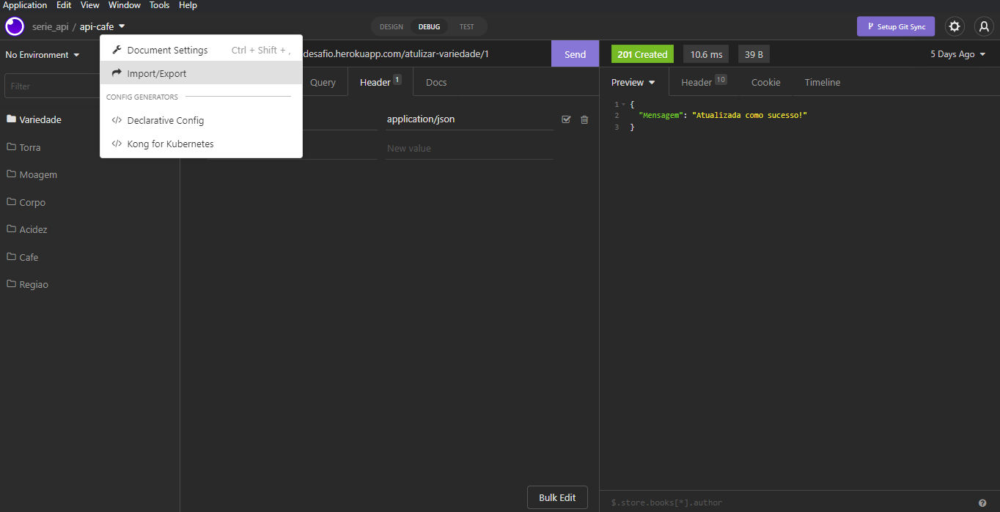
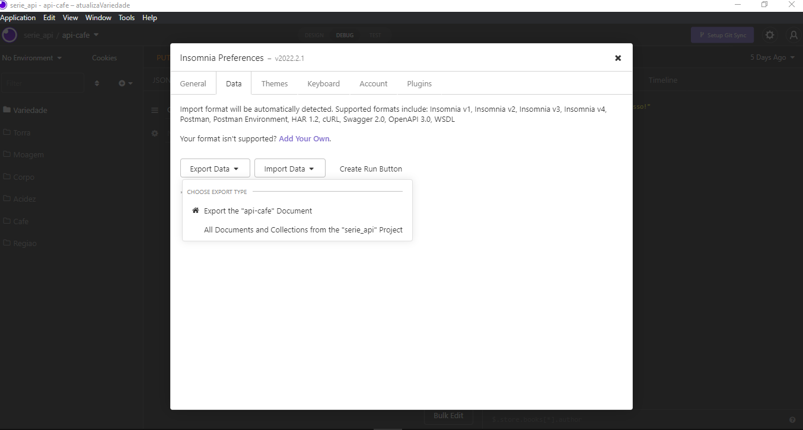
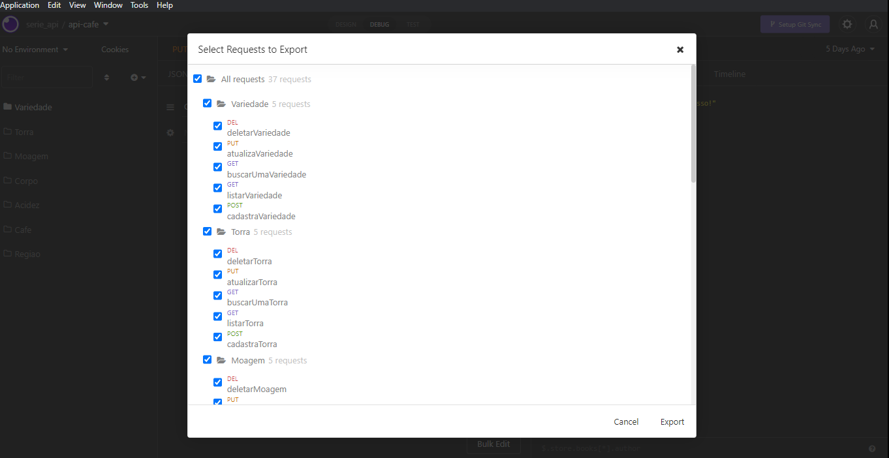
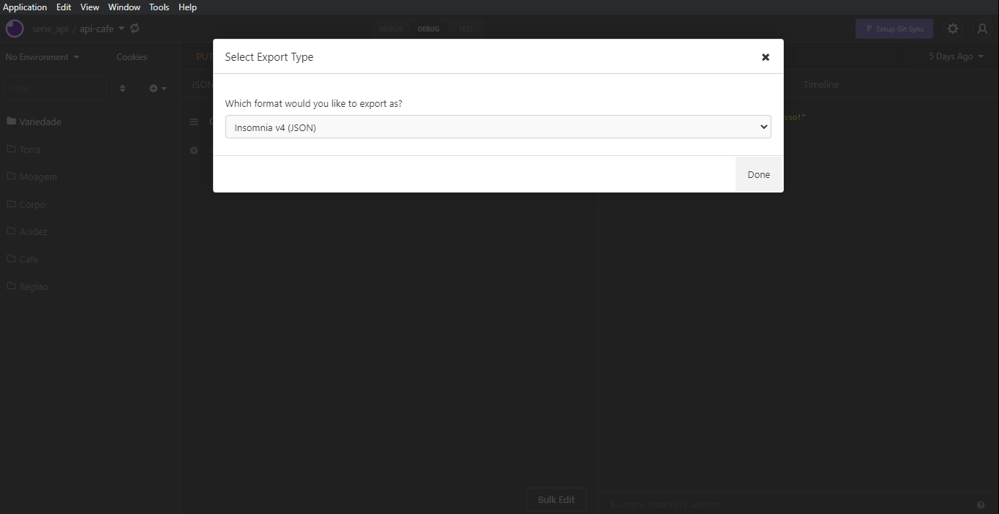

# Documentação da api do Desafio chefão
Nesse documento mostraremos o passo a passo para fazer a documentão de uma api de forma rápida e pratica.
# 1ª - Abra sua api no INSOMNIA e clique em IMPORT/EXPORT.

# 2ª - Clique em DATA e selecione EXPORT DATA e clique na sua api.7

# 3º - Clique em EXPORT.

# 4ª - Clique em DONE e salve seu arquivo em uma pasta.

# 5ª - Abra o seu terminal e navegue até a pasta onde está o seu aquivo json criado no passo anterior.

# 6ª - Nesse ponto digite os seguites comandos em seu terminal.

         npx insomnia-documenter --config <nomedo-seu-arquivo>.json

# 7ª - Segundo comando.

         npx insomnia-documenter --config <nomedo-seu-arquivo>.json --output insomnia-documenter-demo

# 8ª - Ultimo comando é para ver a documentção.

         npx serve

# 9ª - No seu navegador acesse.

         http://localhost:3000/

# Final, agora você pode fazer hospedar a sua documentação.
